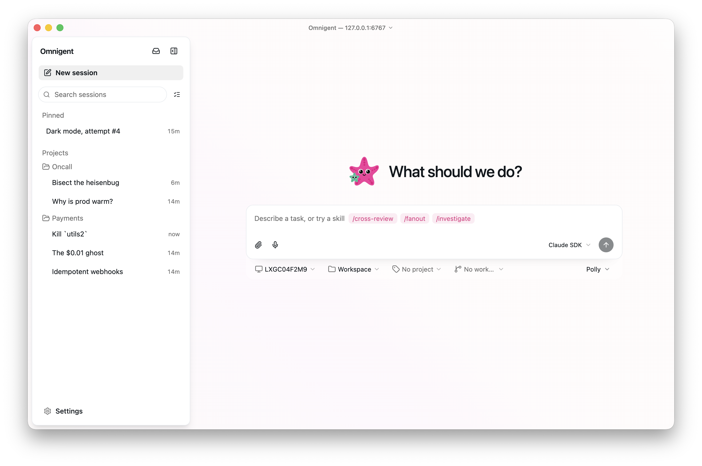

<p align="center">
  
</p>

<h1 align="center">Omnigent 中文版</h1>

<p align="center"><b>把本地 AI 编码 CLI 变成可协作、可观察、默认中文的开发工作台。</b></p>

<p align="center">
  <a href="LICENSE"></a>
  
  <a href="https://github.com/professoryu06/omnigent-zh-cn/actions/workflows/windows.yml"></a>
  <a href="https://github.com/professoryu06/omnigent-zh-cn/actions/workflows/macos.yml"></a>
  <a href="https://github.com/professoryu06/omnigent-zh-cn/actions/workflows/zh-cn-linux-smoke.yml"></a>
</p>

<p align="center">
  <a href="#快速开始">快速开始</a> ·
  <a href="#多-cli-协作">多 CLI 协作</a> ·
  <a href="#平台边界">平台边界</a> ·
  <a href="#文档">文档</a> ·
  <a href="#上游联动">上游联动</a>
</p>

<p align="center">
  
</p>

> **这是完整源码发行版，不是翻译补丁。**
>
> 本仓库包含 Omnigent 核心服务、Web UI、Python SDK 和简体中文改动；安装后直接得到可运行的 Omnigent 中文版，**无需另行安装官方 Omnigent**。源码基于 [omnigent-ai/omnigent](https://github.com/omnigent-ai/omnigent)，保留 Apache-2.0 许可证、NOTICE 和上游归属说明。

---

## 一句话交给 Agent 安装

```text
执行 uv tool install --force --python 3.12 "git+https://github.com/professoryu06/omnigent-zh-cn.git"，随后运行 omnigent-zh setup；Windows 需要 tmux 多 CLI 协作时，请在 WSL2 内执行同一命令。
```

这是公开仓库：安装、clone 和阅读不需要 GitHub Token。源码安装会构建 Web UI，因此设备需要 Python 3.12+、[uv](https://docs.astral.sh/uv/)、Node.js 22+ 和 npm。

## 为什么用它

- **中文优先**：Web UI 默认 `zh-CN`，保留设置中的英文切换；不强行翻译模型名、协议名、命令和代码语法。
- **一个工作台，多种 CLI**：在一个项目会话中使用 Claude Code、Kimi Code、Qwen Code、Hermes、Codex、OpenCode 等 harness，并显示子智能体、文件、终端与执行记录。
- **本机可运行，边界透明**：Windows 原生支持 Web/SDK；需要 tmux/PTY 的完整原生 CLI 协作时，使用 WSL2。
- **不替你保管凭据**：模型 Key 和登录状态仅留在使用者的系统密钥链或本机配置中；仓库不包含任何凭据、会话数据库或日志。
- **可追溯维护**：上游变更会创建人工审查 Issue；中文化、平台适配和安全审计必须通过后才会同步。

## 快速开始

### 1. 安装

```bash
uv tool install --force --python 3.12 "git+https://github.com/professoryu06/omnigent-zh-cn.git"
```

### 2. 检查当前机器模式

```bash
omnigent-zh platform-info
```

它会明确显示当前机器是 Windows Web/SDK 模式、WSL2/Linux 完整模式，还是 macOS 原生模式。

### 3. 配置并启动

```bash
omnigent-zh setup
omnigent-zh
```

首次配置完成后，在浏览器打开本地工作台；从会话中选择 harness、项目目录和模型凭据。刷新后无法连接时，执行：

```bash
omnigent-zh server status
omnigent-zh server start
```

## 多 CLI 协作

Omnigent 的核心不是把多个模型堆在一起，而是让每个 CLI 在独立会话中完成可观察的子任务，再把结果回传给主会话。

| 角色 | 推荐 harness / CLI | 适合的工作 |
| --- | --- | --- |
| 主理与拆解 | Claude Code、Kimi Code、Codex | 明确目标、拆分任务、汇总与调度 |
| 研究与实现 | Claude Code、Kimi Code、Qwen Code、OpenCode | 查资料、实现、测试、写文档 |
| 独立核验 | Qwen Code、Hermes、Codex | 复核结论、检查风险、提出反例 |
| 最终审查 | Codex、Hermes | 检查产物、变更范围与验收条件 |

各 CLI 的可用性取决于你已完成的本地安装与登录。Omnigent 不绕过模型服务商的地区、账户、授权或 API 限制。

<p align="center">
  
</p>

## 平台边界

| 平台 | Web / SDK harness | 原生 CLI + tmux | 沙箱机制 | 推荐方式 |
| --- | ---: | ---: | --- | --- |
| Windows 原生 | 支持 | 不支持 | Job Object，不隔离文件与网络 | Web / SDK 工作流 |
| Windows + WSL2 | 支持 | 支持 | bubblewrap | Windows 上的完整多 CLI 工作模式 |
| macOS | 支持 | 支持 | seatbelt | 原生完整模式 |
| Linux | 支持 | 支持 | bubblewrap | 原生完整模式 |

Windows 原生没有可用的 tmux/PTY 运行时，因此 Claude、Kimi、Qwen、Hermes 等原生 CLI 协作应在 WSL2 中运行。不要把 Windows 原生 Web 可启动误判为原生 CLI 已可用。

## 上游联动

本仓库与 [omnigent-ai/omnigent](https://github.com/omnigent-ai/omnigent) 保持**源码级联动**，而不是运行时依赖联动：安装本仓库就已包含完整运行代码。

- 每周的 `Upstream watch` 会检查上游默认分支；发现新 revision 时创建或更新 `upstream-sync` Issue。
- 同步必须在独立分支中人工审查：先比较上游差异，再保留 `zh-CN`、独立分发命名、平台提示与发布审计，最后运行测试。
- 工作流不会自动 merge 或 push 上游代码。

完整流程见 [UPSTREAM.md](UPSTREAM.md)。

## 文档

| 文档 | 内容 |
| --- | --- |
| [安装总览](docs/zh-CN/INSTALL.md) | 前置条件、安装、更新与启动 |
| [Windows 与 WSL2](docs/zh-CN/WINDOWS_WSL2.md) | tmux 原生 CLI 的完整路径 |
| [macOS](docs/zh-CN/MACOS.md) | seatbelt、tmux 与本机检查 |
| [故障排查](docs/zh-CN/TROUBLESHOOTING.md) | 服务、Git 安装、模型与 Hermes 已知问题 |
| [交给 Agent 的安装指令](docs/zh-CN/AGENT_INSTALL.md) | 可直接复制的执行约束 |
| [上游与许可证](UPSTREAM.md) | 来源、同步策略与维护范围 |

## FAQ

**需要再安装官方 Omnigent 吗？**

不需要。本项目就是完整源码发行版；安装官方包可能造成版本与命令混淆。

**为什么 Windows 上不能直接跑 tmux 多 CLI？**

原生 Windows 没有 Omnigent 原生 harness 所需的 tmux/PTY 运行环境。使用 WSL2 是完整、已验证的路径。

**能否把 API Key 放进仓库？**

不能。使用 `omnigent-zh setup`、系统密钥链或本机 `.env`；发布审计会阻断常见密钥、数据库、日志和构建缓存。

**Hermes 可以做唯一审批者吗？**

不建议。当前运行链路中 Hermes 首次派发可能只产生 `resource_event`；应确认会话历史存在真实任务消息，并由其他执行体或审查者交叉验证。

## 贡献与许可证

欢迎通过 Issue 和 Pull Request 改进中文化、文档、平台适配与测试。涉及上游同步或大范围 UI 词典调整时，请先说明影响范围和验证方式。

本项目遵循 [Apache License 2.0](LICENSE)，必须保留 [NOTICE](NOTICE) 与上游版权声明。Omnigent 是其原始作者和贡献者的项目名称与商标；本仓库不代表官方支持渠道。
